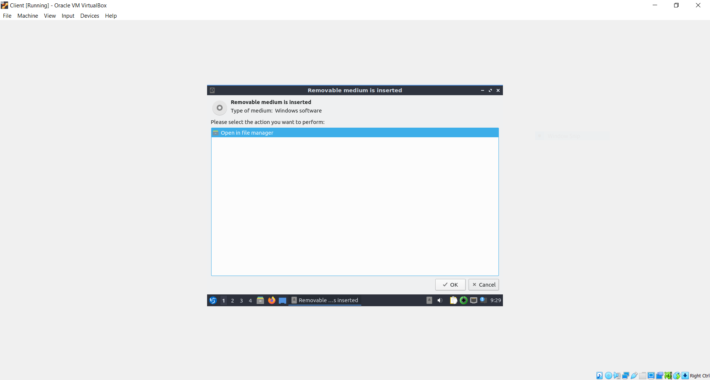

# Git, Ansible, Jenkins, Docker, Kubernetes DevOps Pipeline #


## 1. Create New VirtualBox Virtual Machines (VMs) ##

Create a Master VM and any number of Client VMs.


Mount and install VirtualBox Guest Additions.




Click the following tab on your VMs:

```
View/Adjust Window Size
```

Maximize, or scale, your VM window(s).


(Optional) Enable bi-directional copy and paste use clipboard between host machine and VMs. Click the following tab on your VMs:

```
Devices/Shared Clipboard/Bidirectional
```

Ensure you are running an up-to-date Operating System (OS). If you are not, follow the on-screen updates/upgrades.


## 2. Install Jenkins ##

### A. Install Java: ###

Install OpenJDK 8 on your Master VM:

    sudo apt-get install openjdk-8-jdk

### B. Install Docker: ###

Install Docker on your Master VM:

Ensure you are following the most up-to-date documentation: [https://docs.docker.com/engine/install/](https://docs.docker.com/engine/install/)

Installation requires you to run the following commands on your Master VM:

    sudo apt remove docker docker-engine docker.io containerd runc
    sudo apt update
    sudo apt install \
    apt-transport-https \
    ca-certificates \
    curl \
    gnupg-agent \
    software-properties-common
    curl -fsSL https://download.docker.com/linux/ubuntu/gpg | sudo apt-key add -
    sudo apt-key fingerprint 0EBFCD88
    sudo add-apt-repository \
       "deb [arch=amd64] https://download.docker.com/linux/ubuntu \
       $(lsb_release -cs) \
       stable"
    sudo apt update
    sudo apt install docker-ce docker-ce-cli containerd.io

### c. Install Jenkins: ###

Install Jenkins on your Master VM. Ensure you are following the most up-to-date documentation: [https://www.jenkins.io/doc/book/installing/](https://www.jenkins.io/doc/book/installing/)

Installation requires you to run the  following commands on your Master VM:


    wget -q -O - https://pkg.jenkins.io/debian-stable/jenkins.io.key | sudo apt-key add -
    sudo sh -c 'echo deb https://pkg.jenkins.io/debian-stable binary/ > \
    /etc/apt/sources.list.d/jenkins.list'
    sudo apt update
    sudo apt install jenkins

### D. Modify config.xml: ###

Modify ```/var/lib/jenkins/config.xml``` to change ```<useSecurity>true</useSecurity>``` to
```<useSecurity>false</useSecurity>```


Restart Jenkins:

    sudo systemctl restart jenkins

### E. Install Plugins: ###


Configure Jenkins URL:


Install Plugins:

Click Manage Jenkins/Manage Plugins/Available and search for:

1. Python
2. ShiningPanda
3. Docker
4. Docker Pipeline
5. CloudBees Docker Custom Build Environment

Ensure you have selected all plugins then click ```Download now and install after restart```


When plugins have been downloaded successfully, click ```Restart Jenkins when installation is complete and no jobs are running``` then click ```Go back to the top page```


## 3. Create a Jenkins Pipeline ##

Click ```New Item / Pipeline``` and give it a name. Then click ```OK```


Under the General Tab, click ```GitHub Project``` and add your ```Project url```


Under **Build Triggers**, click ```Poll SCM``` and set the Schedule as you'd like. To check SCM every minute, type ```* * * * *```

Under **Pipeline**, select ```Pipeline script from SCM``` for ```Definition```
Select ```Git``` for ```SCM```
Add your Repository URL

Change ```Branches to build``` to ```*/main```

For ```Additional Behaviors``` click ```Add``` and select ```Clean before checkout```. Click ```Delete untracked nested repositories```


At the bottom of the page, click ```Apply```. Shortly after, click ```Save```.


## 4. Install Ansible ##

Install Ansible on your Master VM. Ensure you are following the most up-to-date documentation: [https://docs.ansible.com/ansible/latest/installation_guide/intro_installation.html](https://docs.ansible.com/ansible/latest/installation_guide/intro_installation.html)

Installation requires you to run the  following commands on your Master VM:


    sudo apt update
    sudo apt install software-properties-common
    sudo apt-add-repository --yes --update ppa:ansible/ansible
    sudo apt install ansible


### A. Modify hosts files: ###

Obtain the IP Address(es) of your Client VM(s). Add the IP Address(es) to both of the following hosts files:


- /etc/hosts
- /etc/ansible/hosts


NOTE: The Ansible hosts file is called the Inventory.

### B. Configure SSH: ###

Install openssh-server on Client VM:
```
sudo apt install openssh-server
```

Generate a new SSH Key and copy the public key to your Client VM:

    ssh-keygen
    ssh-copy-id client@client


NOTE: Replace ```client@client``` with your username and host. In the command above, the right-side of @ is the host, or IP Address. The left-side of @ is the username which currently exists on the host.